# Quadstick e-ink display

Display the current Quadstick keys configuration on an e-ink display. 

Useful as a quick reference for the current key bindings when playing games.

**Legal Disclaimer**

* [Quadstick](https://www.quadstick.com) is a trademark of Quadstick. 
* [Raspberry Pi](https://www.raspberrypi.com) is a trademark of the Raspberry Pi Foundation. 
* [Waveshare](https://www.waveshare.com) is a trademark of Waveshare Electronics. 

> _All other trademarks mentioned herein are the property of their respective owners._

## Handling Quadstick CSV files

| Uploads must be done through the web interface | Display a given key-set can be done through the web |
|:----------------------------------------------:|:---------------------------------------------------:|
|   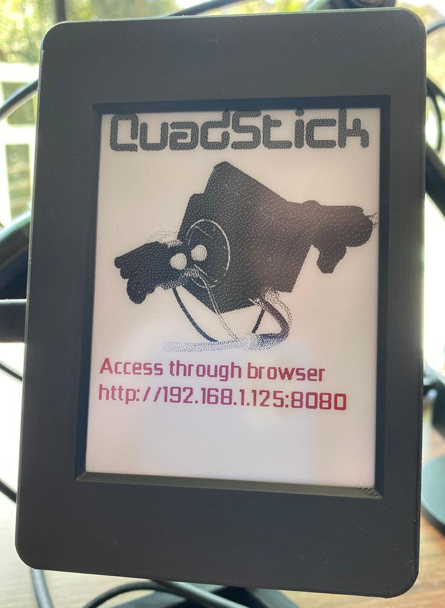    | 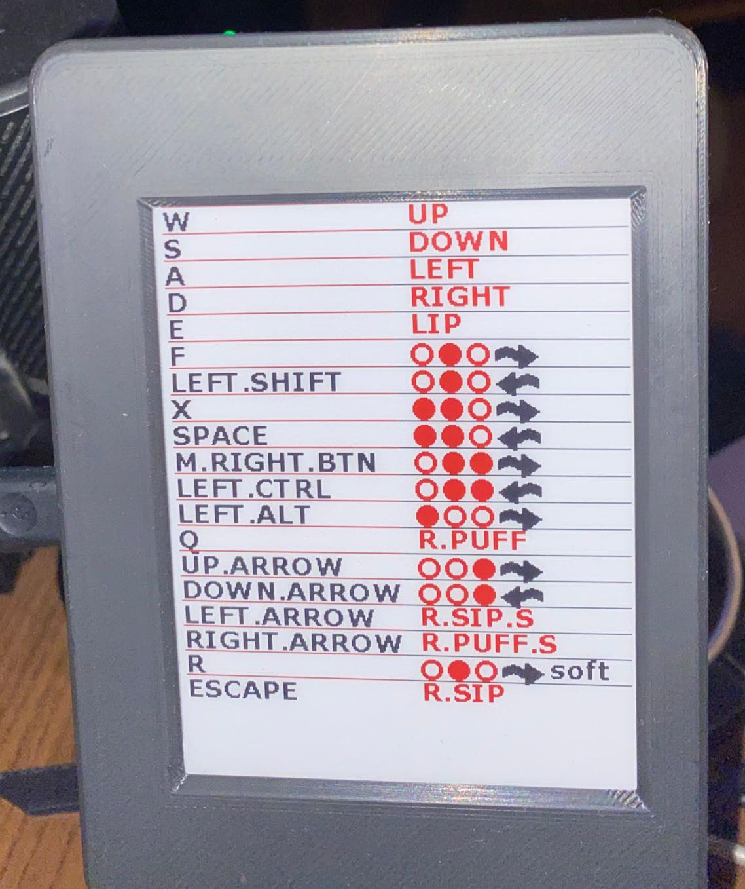  |

## The arrow represents the air flow direction

|  **Sip** is represented by left arrow   |  **Puff** is represented by right arrow   | **Sip soft** and **Puff soft** are represented by the `soft` text |
|:---------------------------------------:|:-----------------------------------------:|:-----------------------------------------------------------------:|
| 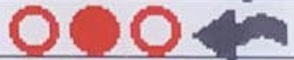 |  |                |

## 3D Printed case View

|                    **Rear view**                    |                       **Connectors view**                       |
|:---------------------------------------------------:|:---------------------------------------------------------------:|
| 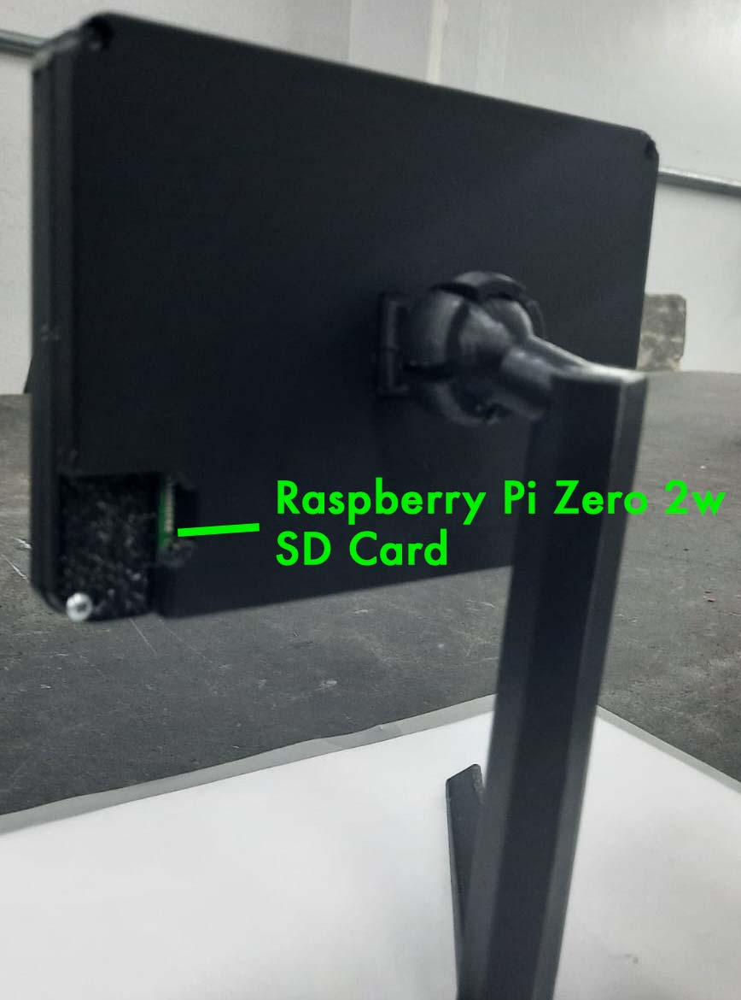 | 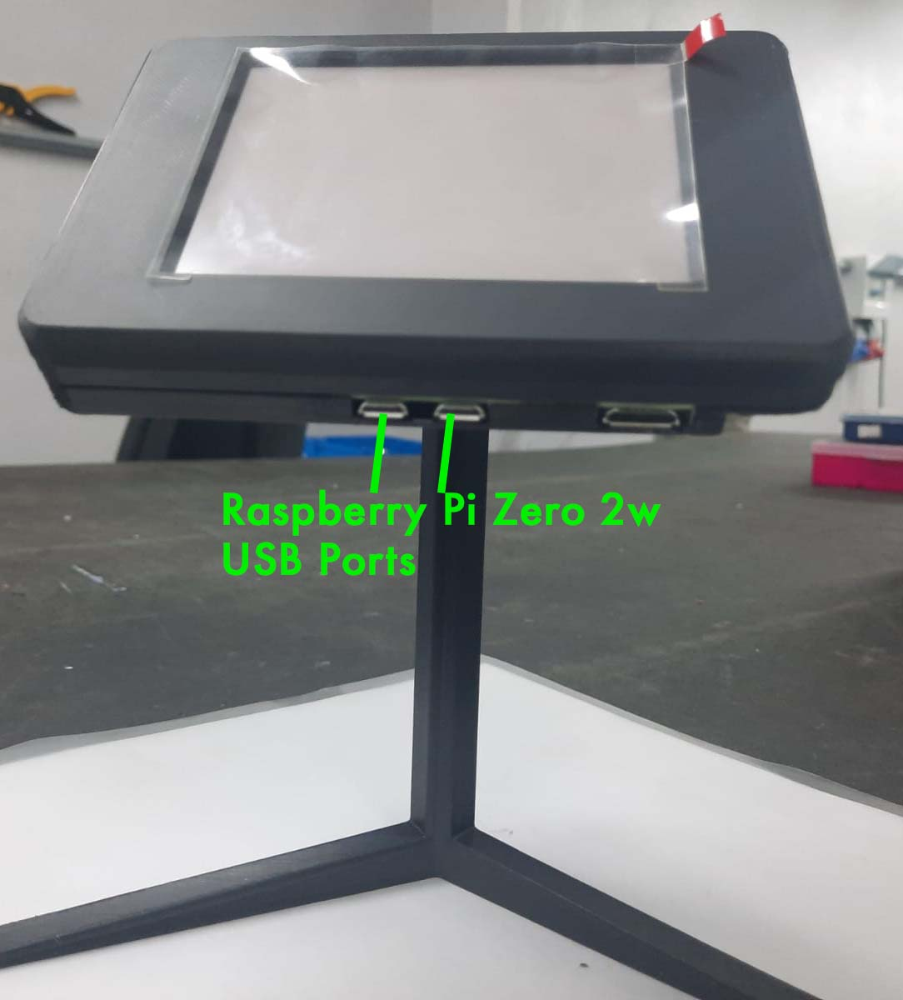 |

## Hardware

* [Waveshare 4.2 inch e-ink display](https://www.waveshare.com/wiki/4.2inch_e-Paper_Module_Manual#Working_With_Raspberry_Pi)
* [Raspberry Pi Zero 2 W](https://www.raspberrypi.com/products/raspberry-pi-zero-2-w/)

### Wiring

| Waveshare          | Raspberry Pi |
|--------------------|--------------|
| VCC                | Pin 1        |
| GND                | Pin 6        |
| DIN (MOSI)         | Pin 19       |
| CLK (SCLK)         | Pin 23       |
| CS  (Chip Select)  | Pin 24       |
| DC  (Data/Command) | Pin 22       |
| RST (Reset)        | Pin 11       |
| BUSY               | Pin 18       |

#### Raspberry Pi Pinout

|                **Raspberry Pi Zero 2 W Pinout**                 |           **Waveshare 4.2 inch e-ink display**            |
|:---------------------------------------------------------------:|:---------------------------------------------------------:|
| 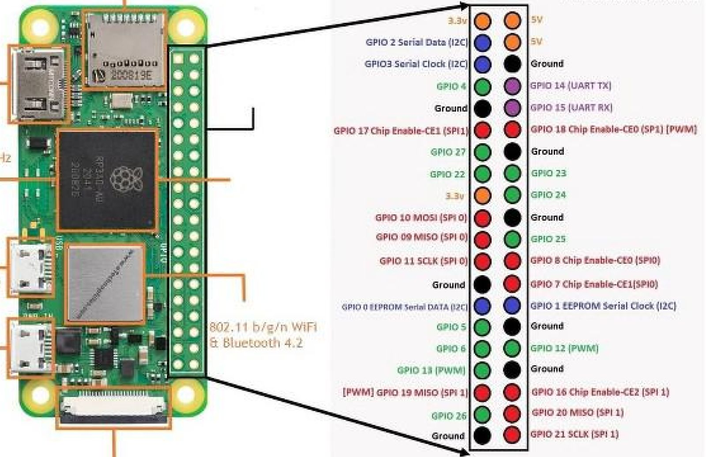 | 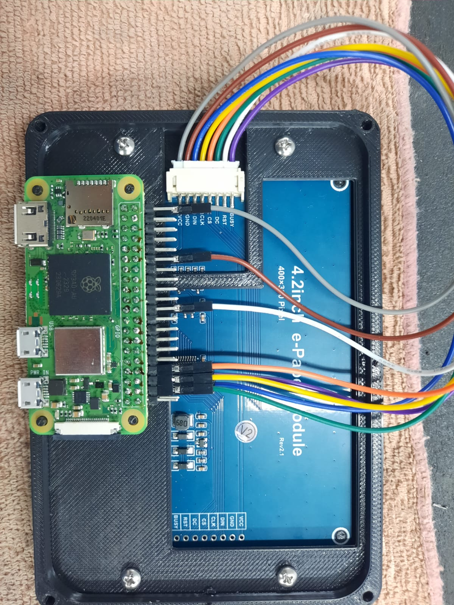 |


## Software

Download the [Raspberry Pi Imager](https://www.raspberrypi.com/software/). 

Use it to flash the **Raspberry Pi OS Lite** image to a microSD card.

`For Raspberry Pi Zero 2 W: 64 Bit > Raspberry Pi OS (other) > Raspberry Pi OS Lite (64-bit)` <br>
`For Raspberry Pi Zero W:   32 Bit > Raspberry Pi OS (other) > Raspberry Pi OS Lite (32-bit)`

<details>

<summary>Expand for detailed instructions with screenshots</summary>

### Raspberry Pi Imager Steps

|             **Select Device #1**              |             **Select Device #2**              |
|:---------------------------------------------:|:---------------------------------------------:|
| 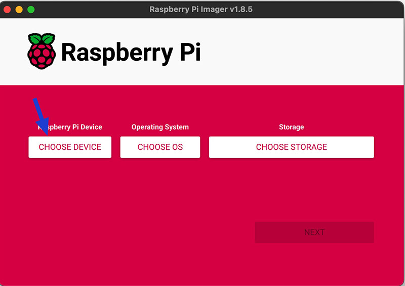 | 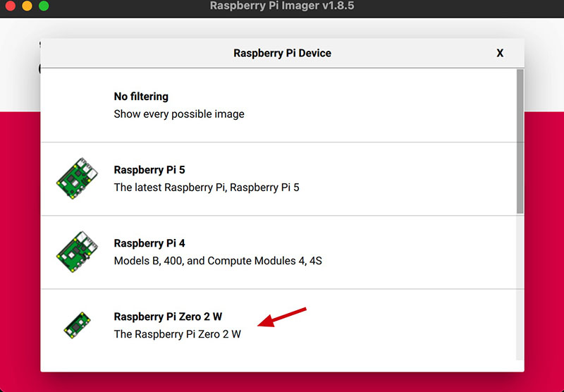 |

|               **Choose OS #1**                |               **Choose OS #2**                |
|:---------------------------------------------:|:---------------------------------------------:|
| 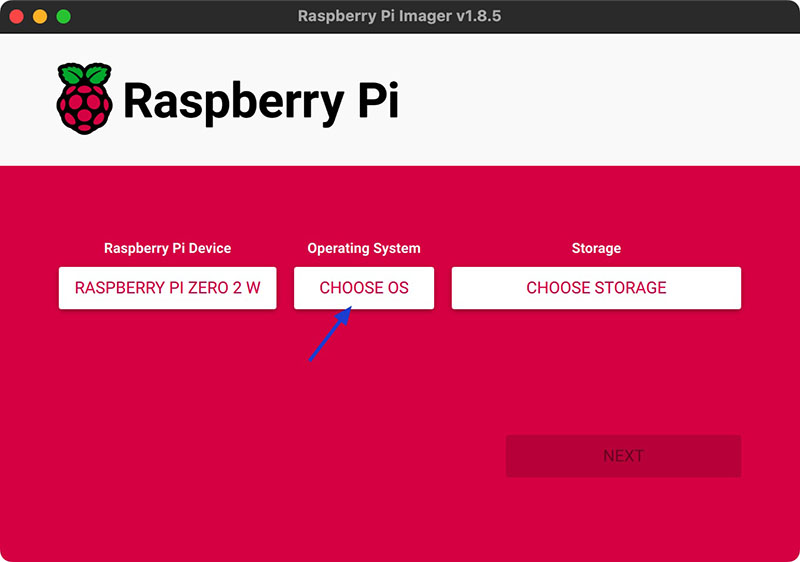 | 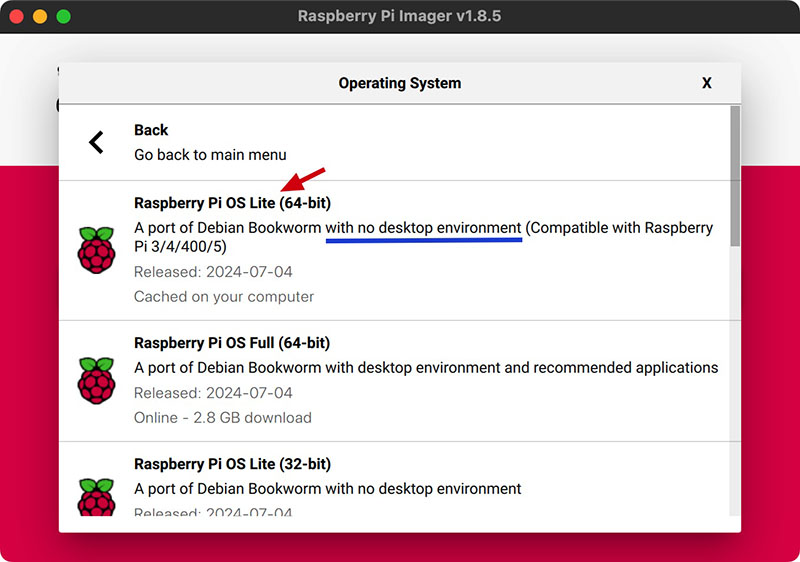 |

> On Raspberry Pi OS (other) category with NO Desktop Environment

<br>

|              **Choose Storage**               |             **Edit Settings #1**              |
|:---------------------------------------------:|:---------------------------------------------:|
| 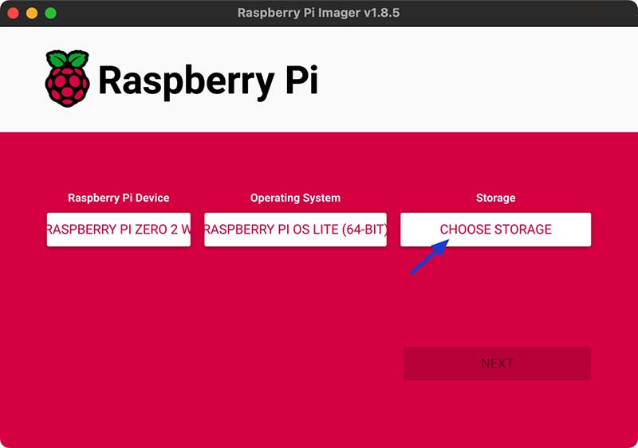 | 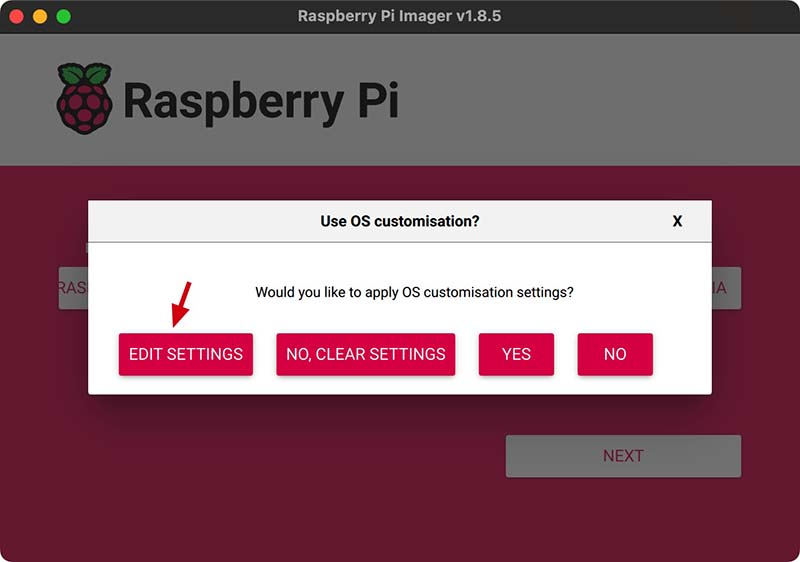 |

> Change the custom settings by clicking on the `Edit Settings` button

<br>

#### Raspberry Pi Custom Settings Steps

##### On the `General` tab

1. Set the hostname to 'qs-display'
2. Set the username and password as you prefer
3. Set the Wi-Fi SSID, password and country code <br>
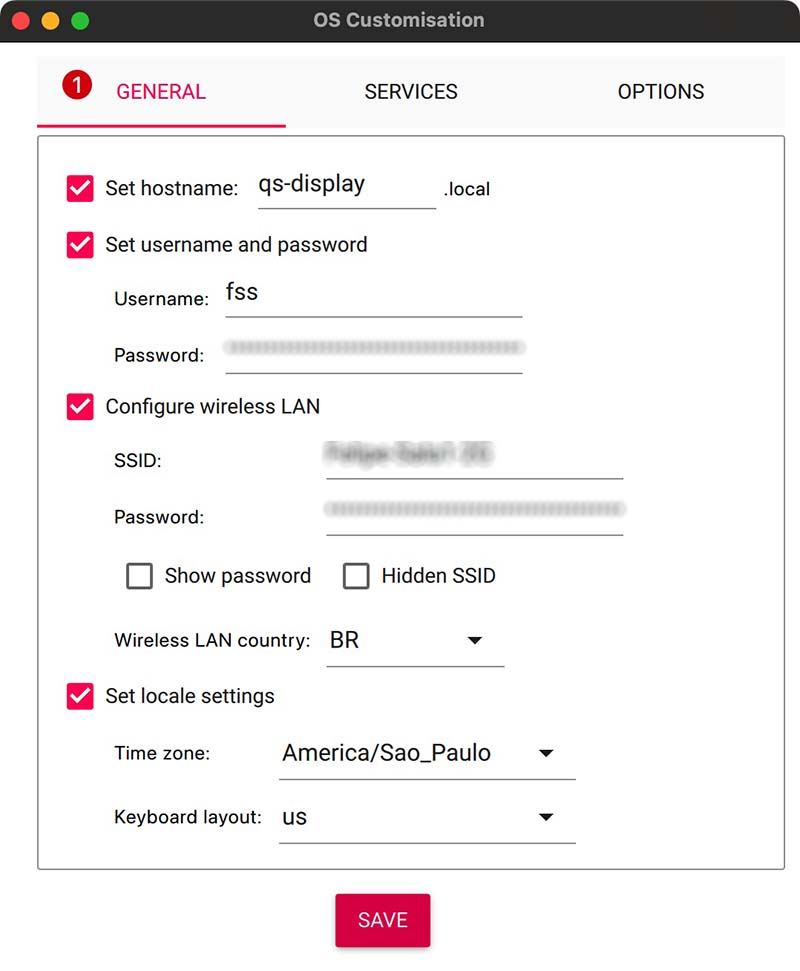 <br>

> Raspberry Pi Zero's support 2G Wi-Fi only

##### On the `Services` tab

1. Enable SSH <br>
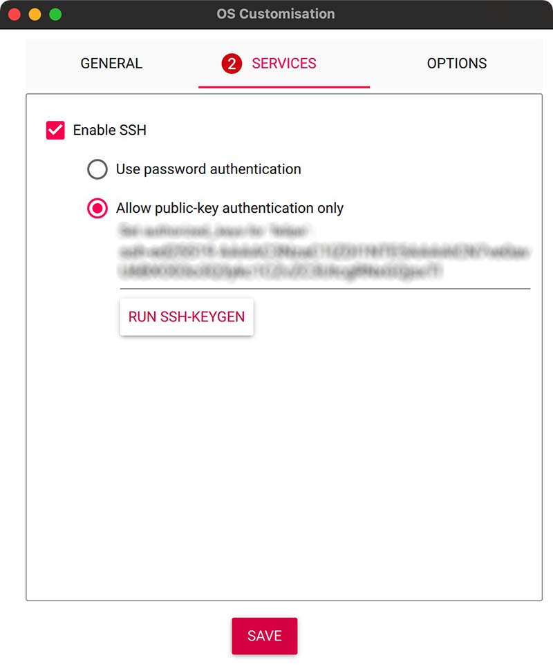 <br>
2. Press `Save` and then `Write` to flash the image to the microSD card

> **Note**: SSH can be used with `password` or `public-key` based authentication. 

</details>

### Installing

Download the `installer` package from the releases

Copy the `installer` package file to the Raspberry Pi

<details>

<summary>How to copy the file to Raspberry Pi On Windows</summary>

1. Download and install [WinSCP](https://winscp.net/eng/download.php)
2. Open WinSCP and enter the Raspberry Pi IP address, `username` and `password`
3. Navigate to the folder where the `installer` file is located
4. Drag and drop the file to the Raspberry Pi

</details>

<details>

<summary>How to copy the file to Raspberry Pi On Linux and MacOS</summary>

1. Open a terminal
2. Use `scp` to copy the file to the Raspberry Pi

```bash
scp quadstick-display.sh <username>@<raspberry_pi_ip>:/home/<username>
```

</details>

Access the Raspberry Pi using SSH

<details>

<summary>How to access the Raspberry Pi On Windows</summary>

1. Download and install [PuTTY](https://www.putty.org/)
2. Open PuTTY and enter the Raspberry Pi IP address
3. Click `Open` and enter the `username` and `password`
4. You should now be connected to the Raspberry Pi

</details>

<details>

<summary>How to access the Raspberry Pi On Linux and MacOS</summary>

1. Open a terminal
2. Use `ssh` to connect to the Raspberry Pi
3. Enter the `username` and `password`
4. You should now be connected to the Raspberry Pi

</details>

Install the `installer` package on the Raspberry Pi

```bash
chmod +x quadstick-display.sh && ./quadstick-display.sh
```
