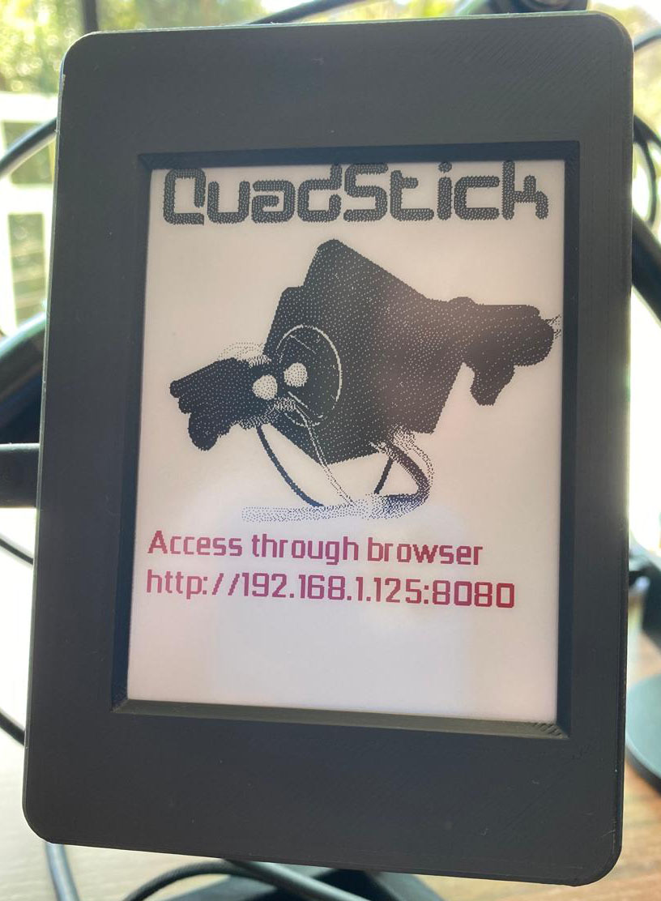
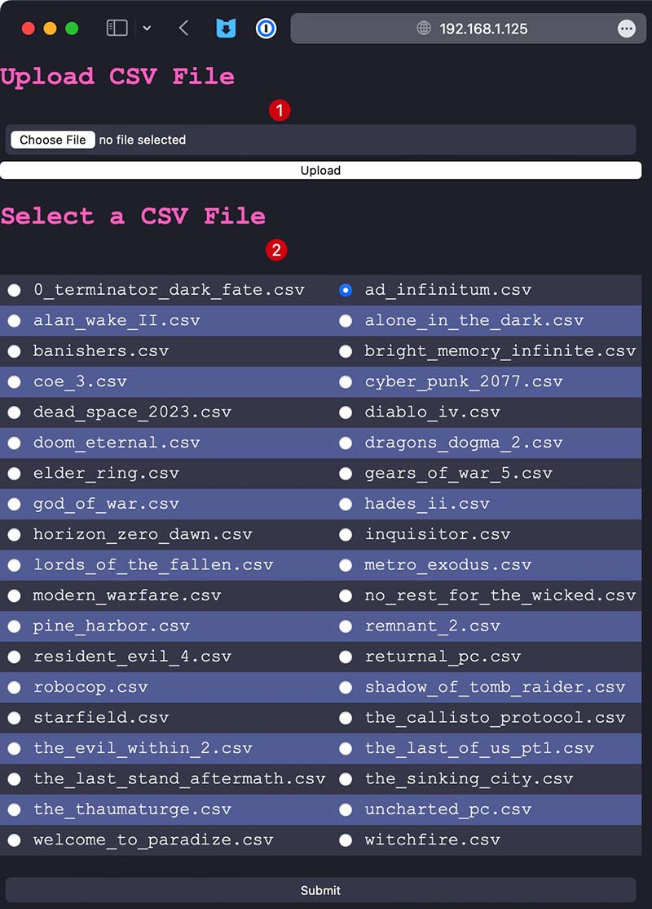
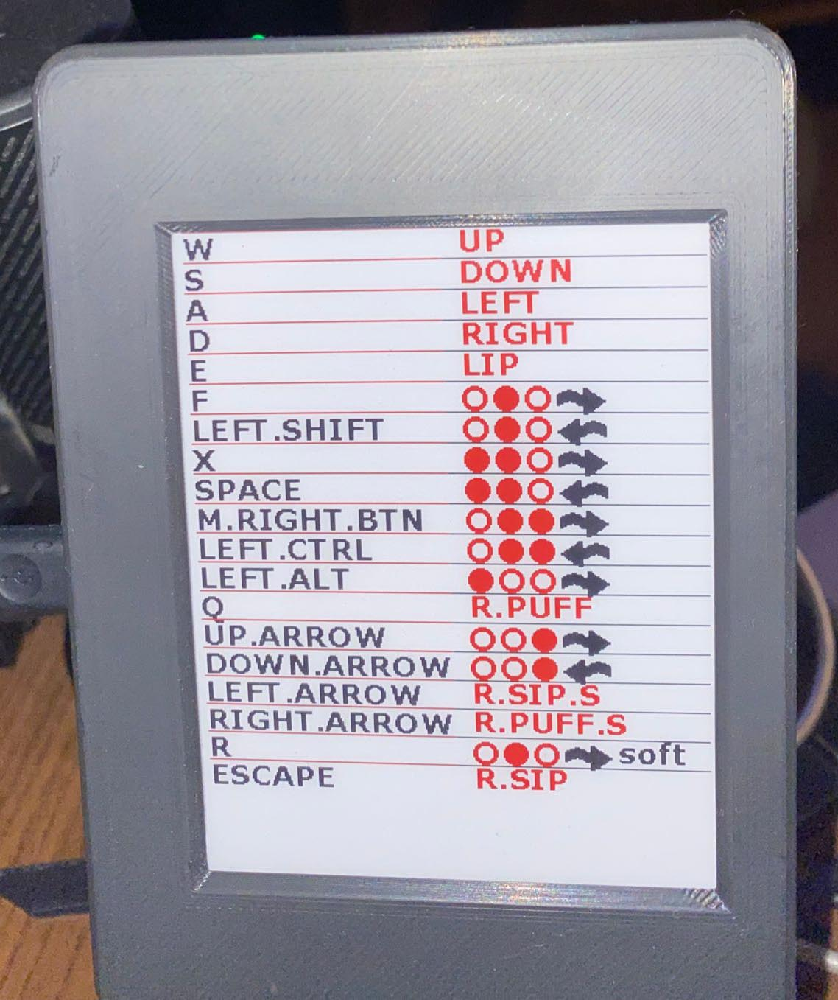
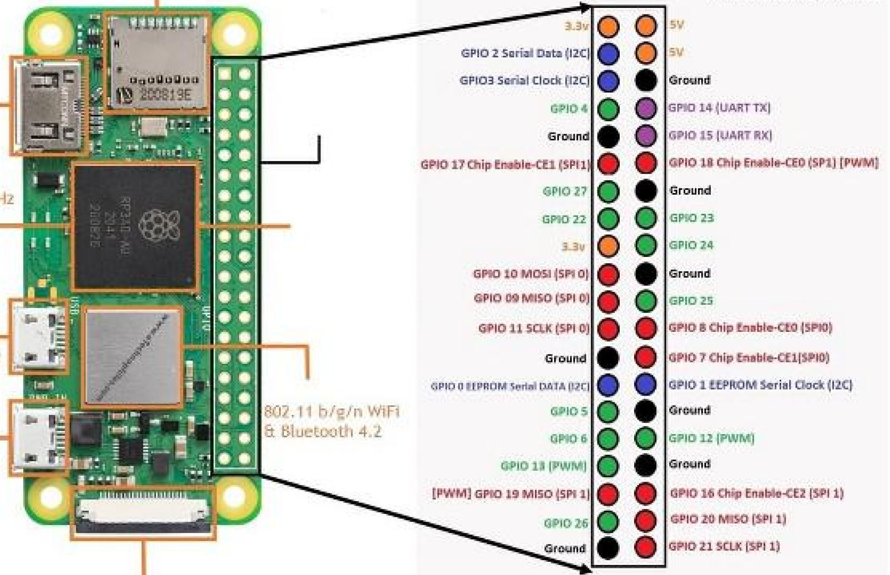
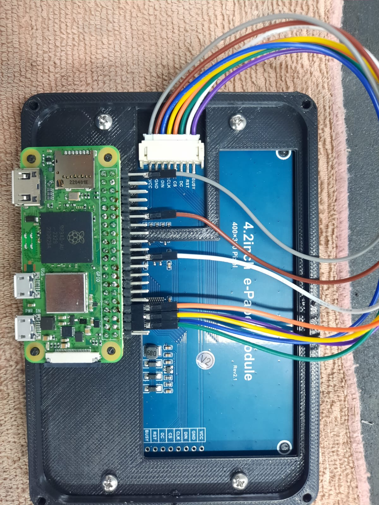
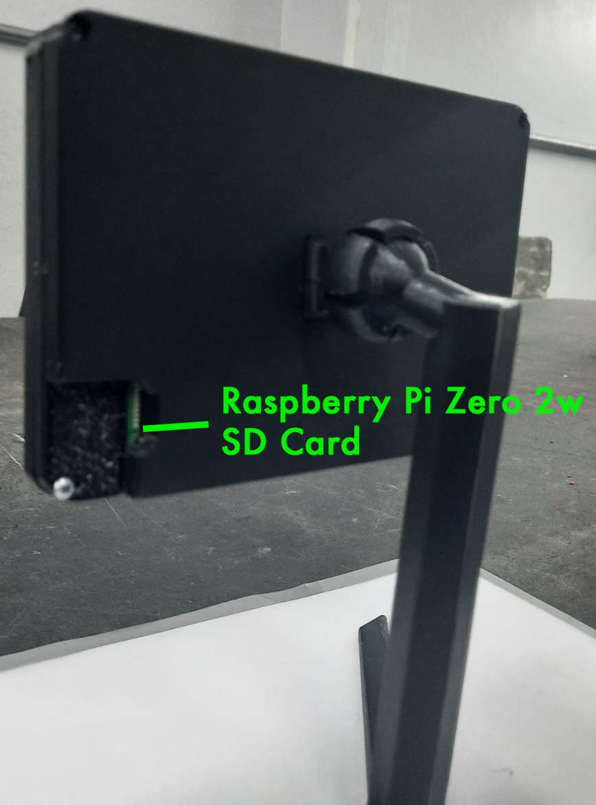
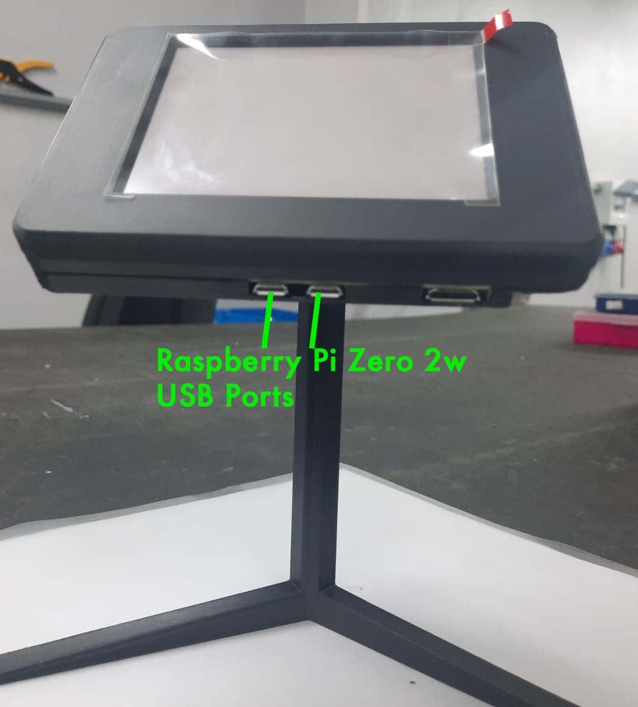

# Quadstick e-ink display

Shows the current [Quadstick](https://www.quadstick.com) key configuration on a
Waveshare e-ink display — a quick reference for the active key bindings while
playing games. A small web interface on port 8080 is used to upload and select
profiles.

## Usage

|                 Startup screen (shows the URL)                 |                  Web interface: upload and select                  |              Rendered key set              |
|:--------------------------------------------------------------:|:------------------------------------------------------------------:|:------------------------------------------:|
|                       |           | |

1. Use the CSV file stored on the Quadstick.
2. Open `http://<pi-ip>:8080`, upload the CSV, and select it.
3. The selected key set is rendered on the display.

### Sip / puff legend

The arrow shows the air flow direction.

|      **Sip** = left arrow       |      **Puff** = right arrow       | Soft variants show the `soft` text        |
|:-------------------------------:|:---------------------------------:|:-----------------------------------------:|
|  |  |  |

## Hardware

* [Waveshare 4.2 inch e-ink display](https://www.waveshare.com/wiki/4.2inch_e-Paper_Module_Manual#Working_With_Raspberry_Pi)
* [Raspberry Pi Zero 2 W](https://www.raspberrypi.com/products/raspberry-pi-zero-2-w/) (or Zero W)

### Wiring

| Waveshare          | Raspberry Pi |
|--------------------|--------------|
| VCC                | Pin 1        |
| GND                | Pin 6        |
| DIN (MOSI)         | Pin 19       |
| CLK (SCLK)         | Pin 23       |
| CS  (Chip Select)  | Pin 24       |
| DC  (Data/Command) | Pin 22       |
| RST (Reset)        | Pin 11       |
| BUSY               | Pin 18       |

|                **Raspberry Pi Zero 2 W Pinout**                 |           **Waveshare 4.2 inch e-ink display**            |
|:---------------------------------------------------------------:|:---------------------------------------------------------:|
|  |  |

## 3D printed case

Printable parts are in [`3d_case/`](3d_case/).

|                    **Rear view**                    |                       **Connectors view**                       |
|:---------------------------------------------------:|:---------------------------------------------------------------:|
|  |  |

## Installation

1. Flash **Raspberry Pi OS Lite** with the [Raspberry Pi Imager](https://www.raspberrypi.com/software/):
   * Zero 2 W: 64-bit image; Zero W: 32-bit image
   * Under customization: set the hostname to `qs-display`, configure Wi-Fi, and enable SSH
   * Note: the Pi Zero supports 2.4 GHz Wi-Fi only
2. Download `quadstick-display.sh` from the [releases](../../releases) page and copy it to the Pi:

   ```bash
   scp quadstick-display.sh <username>@<pi-ip>:
   ```

3. Run it on the Pi:

   ```bash
   chmod +x quadstick-display.sh && ./quadstick-display.sh
   ```

The installer extracts the application to `/usr/local/quadstick-display`,
creates a virtual environment, and enables the `qs_display_httpd.service`
systemd unit serving the web interface on port 8080. Re-running the installer
upgrades the application in place; custom uploaded CSV profiles are preserved.

## Development

Requires Python 3.10+ and [Poetry](https://python-poetry.org/). The application
is the `quadstick_display` package (MVC split: `model.py`, `view.py`,
`controller.py`, `hardware.py`, `web.py`); `qs_display.py` is the compatibility
entrypoint invoked by the systemd unit, and resources (templates, fonts,
images, CSV profiles) ship in `resources/`.

```bash
make install    # install dependencies via Poetry
make test       # full test suite (no Raspberry Pi hardware required)
make build      # installer artifacts into dist/
make verify     # CI-equivalent: static checks + tests + packaging
```

Run `make help` for all targets. Building the installer requires
`poetry-plugin-export` (`make install-export-plugin` installs it).

Pull requests and branch pushes run tests and packaging with read-only
permissions (`.github/workflows/verify.yml`). Pushing a `v*` tag runs the same
checks and publishes the release (`.github/workflows/release.yml`). Final
acceptance happens on the Raspberry Pi hardware.

## Legal

Quadstick, Raspberry Pi, and Waveshare are trademarks of their respective
owners.
